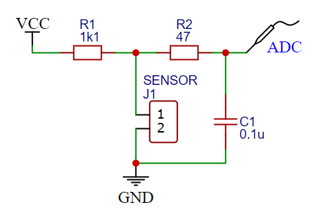
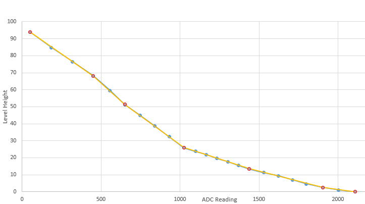

# esp32-level-sensor

This project is used to read a sensor that has different discrete resistance values depending on the height of the float. An ESP32 is used to measure the resistor using a voltage divider:



The following table shows the values and according sensor height that have been manually read and measured. Based on that I've derived sections with linear interpolation in between:

| Height [cm] | ADC  | ADC Points for linear interpolation |
| ----------- | ---- | ----------------------------------- |
| 0           | 2110 | 2110                                |
| 1,1         | 2004 |                                     |
| 2,5         | 1904 | 1903                                |
| 4,6         | 1801 |                                     |
| 7           | 1714 |                                     |
| 9,3         | 1625 |                                     |
| 11,3        | 1532 |                                     |
| 13,4        | 1440 | 1438                                |
| 15,4        | 1373 |                                     |
| 17,6        | 1305 |                                     |
| 19,6        | 1236 |                                     |
| 21,8        | 1167 |                                     |
| 23,8        | 1099 |                                     |
| 25,9        | 1026 | 1025                                |
| 32,3        | 932  |                                     |
| 38,8        | 840  |                                     |
| 45          | 748  |                                     |
| 51,2        | 652  | 651                                 |
| 59,5        | 557  |                                     |
| 68,1        | 451  | 450                                 |
| 76,5        | 321  |                                     |
| 84,8        | 187  |                                     |
| 94          | 50   | 50                                  |



```C++
#include <Arduino.h>

void setup()
{
  Serial.begin(115200);
  while (!Serial) {}  // wait for serial port to connect. Needed for native USB
  pinMode(D3, OUTPUT);
  analogSetAttenuation(ADC_0db);
  digitalWrite(D3, HIGH); // Spannungsteiler wird über D3 versorgt.
}

uint32_t analogSample(uint8_t pin, uint16_t samples)
{
  uint32_t avg = 0;
  for (int i = 0; i < samples; i++)
  {
    uint16_t a = analogRead(pin);
    avg = avg + a;
  }
  avg = avg / samples;
  return avg;
}

int32_t lastAvg = 0;
int32_t state = 0;

void loop()
{
  int32_t a = (int32_t)analogSample(A0, 256);
  if (state == 0 && abs(a - lastAvg) > 10)
  {
    state = 1;
  }
  if (state == 1 && abs(a - lastAvg) < 10)
  {
    state = 0;
    Serial.printf("%d\n", a);
  }
  lastAvg = a;
}
```
