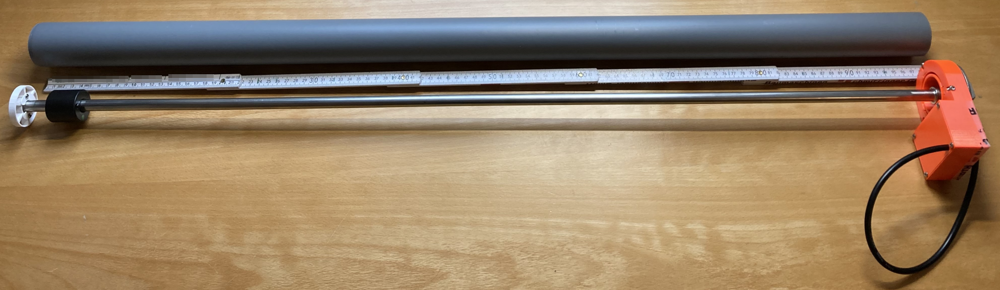
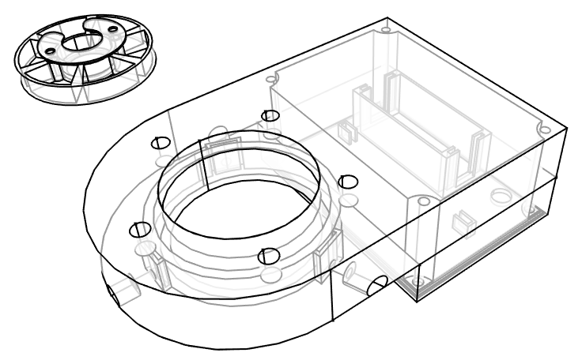
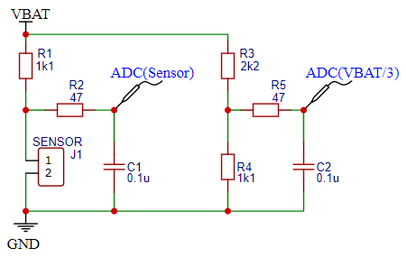
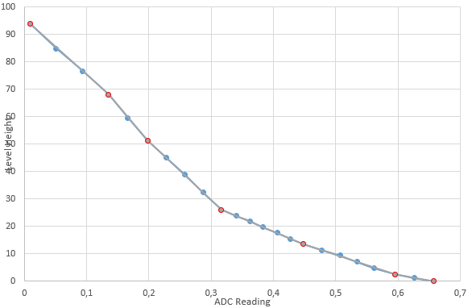

# esp32-level-sensor

This project is used to read a level sensor (water / fuel) that has different discrete resistance values depending on the height of the float and provide them via Bluetooth Low Energy (Bluetooth LE) advertisement messages.

Completely assembled sensor and tube in which the sensor shall be put:



## Microcontroller Board

As microcontroller board the Firebeetle ESP32 has been chosen, because it's cheap, it supports Bluetooth Low Energy and it needs ultra low power in hibernate sleep mode, in which only the RTC is powered and power consumption goes down to 0.008 mA.

See also: <https://diyi0t.com/reduce-the-esp32-power-consumption/>

The board gets powered with a Lithium CR123 battery.

## Sensor

It was crucial to get a reliable and robust level measurement, so I've decided not to use ultra sonic sensors or similar but a sensor with a float and reed switches that switch different resistors at different heights from 240 Ω at the min height and 30 Ω at the max height.

## Case and Spacer

The case at the top and spacer at the bottom are designed in FreeCAD and printed with a filament 3d printer.



## Schematic

Via an ESP32's ADCs and voltage dividers the sensor as well as the battery voltage is measured. Sensor reading is put in relation to battery voltage reading to reduce influence of decreasing battery voltage over the time.



## Sensor readings

The following table shows the values ADC(Sensor) / ADC(VBAT/3) and according sensor height that have been manually read and measured. Based on that I've derived sections with linear interpolation in between:



To compute interpolating polymomial, WolframAlpha's [interpolating polynomial calculator](https://www.wolframalpha.com/input/?i=interpolating+polynomial+calculator&assumption=%7B%22F%22%2C+%22InterpolatingPolynomialCalculator%22%2C+%22data2%22%7D+-%3E%22%7B%7B2110%2C0%7D%2C%7B1903%2C2.5%7D%7D%22) was a great help:

| Height [cm] | ADC(Sensor) / ADC(VBAT/3) | Linearization points                      |
| ----------- | ------------------------- | ----------------------------------------- |
| 0           | 0,658                     | linear fit {{0.658, 0}, {0.595, 2.5}}     |
| 1,1         | 0,626                     |                                           |
| 2,5         | 0,595                     | linear fit {{0.595, 2.5}, {0.448, 13.4}}  |
| 4,6         | 0,562                     |                                           |
| 7           | 0,534                     |                                           |
| 9,3         | 0,507                     |                                           |
| 11,3        | 0,477                     |                                           |
| 13,4        | 0,448                     | linear fit {{0.448, 13.4}, {0.316, 25.9}} |
| 15,4        | 0,427                     |                                           |
| 17,6        | 0,406                     |                                           |
| 19,6        | 0,383                     |                                           |
| 21,8        | 0,362                     |                                           |
| 23,8        | 0,34                      |                                           |
| 25,9        | 0,316                     | linear fit {{0.316, 25.9}, {0.198, 51.2}} |
| 32,3        | 0,287                     |                                           |
| 38,8        | 0,258                     |                                           |
| 45          | 0,228                     |                                           |
| 51,2        | 0,198                     | linear fit {{0.198, 51.2}, {0.135, 68.1}} |
| 59,5        | 0,166                     |                                           |
| 68,1        | 0,135                     | linear fit {{0.135, 68.1}, {0.0086, 94}}  |
| 76,5        | 0,0938                    |                                           |
| 84,8        | 0,0511                    |                                           |
| 94          | 0,0086                    | X                                         |

## Software

The sensor wakes up every few minutes to check the height, battery and wakeup cycle. In case the sensor's height is above 0.5 cm or it woke up for more than 8 cycles since last time it sent the readings, it sends them again via Bluetooth Low Energy. Additionally if the hight is above 0.5 cm, the deep sleep time is also decreased to have a higher sampling rate while there is water registered by the sensor.

### Bluetooth Low Energy Advertisements (BLE)

To save battery power the readings shall be provided as manufacturer specific data within sent BLE advertisisements. That way the ESP32 can hibernate again without waiting for a potential incoming connection to read a charactersitic.

For this purpose I've written some helper clases and methods that allow to append sensor readings of integer and float type to a BLE advertisement message.

```cpp
void setup() {
  // read sensor and battery power
  // set txCounter if readings shall be sent in this wake cycle
  // set sleepSeconds how long the ESP32 shall hibernate after this cycle

  if (txCounter > 0) {
    // sensor readings shall be sent in this wake cycle when txCounter > 0
    Ble::DataElements dataElements = {
        Ble::DataElement(wakeupCounter),
        Ble::DataElement(rawFillingLevel),
        Ble::DataElement(fillingLevel),
        Ble::DataElement(rawBatteryStatus),
        Ble::DataElement(normalisedFillingLevelRaw)};

    Ble::advertise(dataElements);
    delay(80); // wait as long as the message is to be sent repeatedly
  }
  wakeupCounter++;
  deepSleep(sleepSeconds);
}
```

### Home Assistant Integration

I've also written a generic BLE Home Assistant custom component that allows to import the sensor readings. I've tried to design that compnent as generic as possible so that multiple advertisements as well as BLE characteristic readings can be configured to be read and decoded appropriately.

See:
<https://github.com/mfmayer/home_assistant_custom_components/tree/main/ble_generic_sensor>